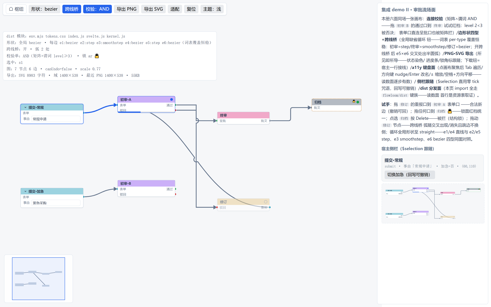
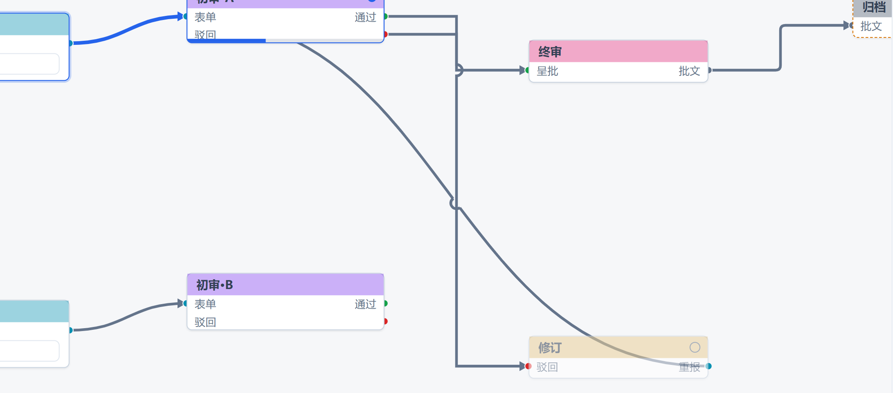
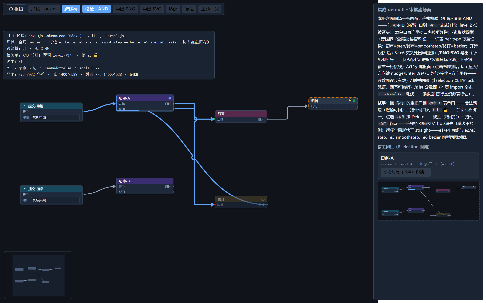

# flowloom

English | [中文](README.zh-CN.md)

A full-featured node editor canvas library: **a framework-agnostic kernel + a Svelte 5 rendering layer**. MIT licensed.



## Why flowloom

**1. The complete node-editor interaction set, all built in**

Drag-to-connect and re-wire, drop-on-empty-canvas to create and auto-connect, double-click search placement, sidebar drag-and-drop, box select, cross-tab copy-paste, snapshot undo/redo, groups, nested subgraphs, reroute waypoints, minimap, six-axis align + distribute + layered auto layout, floating selection toolbox, context menu, inline rename, node collapse, connection validation, four edge shapes with cross-over bridges, directed arrows — everything in the table below ships in the kernel and components, not as plugins.

**2. Designed for external data sources and AI agents**

A canvas that mirrors an external source of truth (database / polling / event stream / agent output) is a first-class scenario: `applyExternal` / `applyGraph` apply external changes with **zero snapshots** that survive undo/redo — **undo strictly rolls back user actions only**. The library is not in any AI training corpus, so every public-gate error message carries three elements — cause, legal options, recovery verb — making the runtime errors act as documentation for agents. Registry `initialData` seeding, connection rules, and structural locks let agent output land safely.

**3. Light, with a headless kernel**

Zero runtime dependencies; the only peerDependency is `svelte ^5`. The kernel is pure TypeScript with zero DOM coupling: interaction state machines, the command registry, and layout math all run standalone — feed normalized input events in Node and the full interaction logic runs without a browser. Ideal for headless testing and viewport math.



## Install & quick start

Not yet published to npm (`private: true`); the official private distribution channel is the prebuilt `dist` bundle committed in-repo (copy four files, keep `svelte` external — see the [usage manual](docs/usage.md) for the vendor guide).

```js
import { createNodeRegistry, createGraph } from 'flowloom/kernel';
import { createCanvasController, CanvasView } from 'flowloom/svelte';
import 'flowloom/tokens.css';

const registry = createNodeRegistry([
  { typeId: 'step', label: 'Step', inputs: [], outputs: [{ portId: 'out', label: 'Next' }] },
]);
const controller = createCanvasController({ registry, initialGraph: createGraph() });
// Svelte host: <CanvasView {controller} /> — wheel zoom, panning, fit-view,
// double-click search, drag-to-connect all work out of the box
```



## Feature table

| Area | Capabilities |
|---|---|
| Placement & wiring | Double-click search placement / sidebar drag-drop / drop-on-empty auto-connect; port drag-to-connect, re-wire; connection validation (type-compat matrix AND predicate); edge shapes bezier/straight/step/smoothstep (per-type + global); cross-over bridges (semi-circular arcs at edge-edge crossings); directed arrows (screen-constant 11px, auto-flip on back edges); reroute waypoint chains |
| Selection & editing | Box select / Ctrl-click / drag / Delete; copy-paste (versioned contract, cross-tab, offset on repeat); snapshot undo/redo (gesture-level granularity); inline rename; two-state node collapse; floating selection toolbox; context menu (items fully host-injected) |
| Structure | Groups (group/ungroup/fit-to-contents); nested subgraphs (boundary port proxies + breadcrumbs + per-container viewport memory); six-axis align + distribute + layered auto layout (L→R default) |
| Presentation & theming | Light/dark token sheet (`data-fl-theme` / follows system); category and port type colors (registry-declared, open token set); on-node widgets (five built-in kinds + custom component slot); properties panel; minimap (zero-wiring self-measuring); node state display (live status/progress, zero undo pollution); PNG·SVG export (self-contained, WYSIWYG) |
| Integration | Silent external ingestion (changeset + whole-graph gates, snapshot-stack re-anchoring); structural locks (predicate + id-set); command-registry keybindings (commands/bindings split, rebindable, canvas-focus scoped); a11y keyboard + aria minimal set; TS generic narrowing (discriminated unions); multi-instance isolation; headless kernel; UI-format persistence (semantic/layout/viewport in separate keys) |

## Documentation

- [Usage manual (English)](docs/usage.en.md) / [使用手册（中文）](docs/usage.md) — from assembly baseline to every capability, including the full API reference
- Live demo: pending deployment (run `npm run play` locally for 21 demo pages; `playground/hub.html` is the tour hub)
- [CHANGELOG](CHANGELOG.md) — release history (Chinese)

## Design principles

1. **Node definitions are host data.** The node registry is an open, host-injected set; the library enumerates no node types.
2. **The kernel is schema-agnostic.** It sees "node = generic record + port descriptors"; domain schemas (UI↔execution projection, validation, catalogs) belong to the consumer's adapter layer.
3. **Engine-agnostic kernel, host-side rendering.** Interaction state machines, the command registry, and layout math live in the kernel (pure functions + state machines over abstract input events, zero DOM/Svelte dependencies); the Svelte layer only renders and normalizes events.
4. **Dual-format separation.** The UI format keeps semantic and layout data in separate keys plus the viewport; layout never enters the semantic hash, so revision detection is immune to tidying.

## Acknowledgments

This library's capability baseline and several designs reference these predecessors:

- [ComfyUI](https://www.comfy.org/): the node-canvas interaction capability baseline (wiring, placement, groups, subgraphs, reroute, collapse)
- [React Flow / Svelte Flow (xyflow)](https://xyflow.com/): API naming and type-level conventions (connection validation, edge shapes, generic narrowing)
- [GoJS](https://gojs.net/): the cross-over bridge interaction convention (arc hops at edge-edge crossings)
- [litegraph.js](https://github.com/jagenjo/litegraph.js): a reference point in the engine/rendering layering trade-off
- The Sugiyama layered-layout algorithm: the mathematical basis of auto layout

## License

MIT
